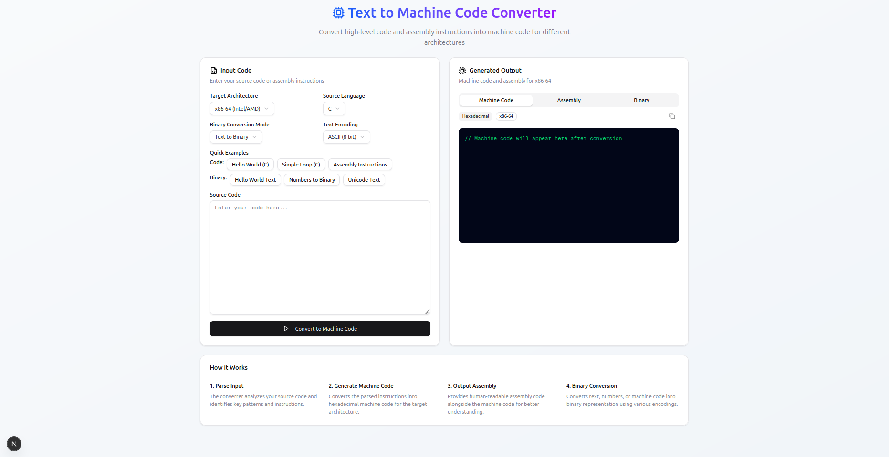

# Text to Machine Code Converter

[](https://nextjs.org/)
[](https://www.typescriptlang.org/)
[](https://tailwindcss.com/)
[](https://opensource.org/licenses/MIT)

A powerful, interactive web-based tool that converts high-level programming code and assembly instructions into machine code for different processor architectures. Built with Next.js 15, TypeScript, and modern React patterns.



## ✨ Features

### 🎯 **Core Functionality**

- **Multi-Architecture Support**: Convert code for x86-64 (Intel/AMD) and ARM64 (Apple Silicon) architectures
- **Multiple Input Languages**: Support for C and Assembly languages
- **Real-time Conversion**: Instant machine code and assembly generation
- **Binary Conversion**: Convert text, numbers, and machine code to binary representation

### 🔧 **Advanced Features**

- **Multiple Text Encodings**: ASCII, UTF-8, and UTF-16 support
- **Interactive Examples**: Quick-load examples for different use cases
- **Copy to Clipboard**: One-click copying of generated output
- **Responsive Design**: Works seamlessly on desktop and mobile devices
- **Dark Theme**: Professional dark-themed output displays

### 🎨 **User Experience**

- **Modern UI/UX**: Clean, professional interface with smooth animations
- **Tabbed Output**: Organized display of machine code, assembly, and binary
- **Visual Feedback**: Toast notifications and loading states
- **Accessibility**: Screen reader friendly with proper ARIA labels

## 🚀 Quick Start

### Prerequisites

- Node.js 18.0 or later
- npm, yarn, or pnpm package manager

### Installation

1. **Clone the repository**

   ```bash
   https://github.com/zntb/nextjs-text-to-machine-code-converter.git
   cd nextjs-text-to-machine-code-converter
   ```

2. **Install dependencies**

   ```bash
   npm install
   # or
   yarn install
   # or
   pnpm install
   ```

3. **Run the development server**

   ```bash
   npm run dev
   # or
   yarn dev
   # or
   pnpm dev
   ```

4. **Open your browser**
   Navigate to [http://localhost:3000](http://localhost:3000) to see the application.

## 📖 Usage

### Basic Conversion

1. **Select your target architecture** (x86-64 or ARM64)
2. **Choose the source language** (C or Assembly)
3. **Enter your code** in the input textarea
4. **Click "Convert to Machine Code"** to generate output
5. **View results** in the tabbed output section

### Binary Conversion Modes

- **Text to Binary**: Convert any text using ASCII, UTF-8, or UTF-16 encoding
- **Machine Code to Binary**: Convert generated machine code to binary representation
- **Numbers to Binary**: Convert decimal numbers to their binary equivalents

### Quick Examples

Use the provided example buttons to quickly load:

- Hello World program in C
- Simple loop structures
- Assembly instructions
- Unicode text samples

## 🏗️ Architecture

### Project Structure

```image
src/
├── app/
│   ├── components/           # React components
│   │   ├── ConfigurationPanel.tsx
│   │   ├── ExampleButtons.tsx
│   │   ├── CodeInput.tsx
│   │   ├── OutputTabs.tsx
│   │   └── InfoSection.tsx
│   ├── constants/           # Application constants
│   │   └── examples.ts
│   ├── types/              # TypeScript type definitions
│   │   └── index.ts
│   ├── utils/              # Utility functions
│   │   ├── machineCodeGenerator.ts
│   │   └── binaryConverter.ts
│   ├── globals.css         # Global styles
│   ├── layout.tsx          # Root layout
│   └── page.tsx            # Main page component
├── components/ui/          # shadcn/ui components
└── lib/                    # Shared utilities
```

### Key Components

- **ConfigurationPanel**: Manages architecture, language, and encoding settings
- **ExampleButtons**: Provides quick-load functionality for code examples
- **CodeInput**: Handles code input with syntax highlighting preparation
- **OutputTabs**: Displays machine code, assembly, and binary output
- **InfoSection**: Educational content about the conversion process

### Technologies Used

- **Framework**: Next.js 15 with App Router
- **Language**: TypeScript for type safety
- **Styling**: Tailwind CSS for responsive design
- **UI Components**: shadcn/ui component library
- **Icons**: Lucide React icons
- **Notifications**: Sonner for toast messages

## 🛠️ Development

### Code Quality

This project follows modern React and TypeScript best practices:

- **Type Safety**: Comprehensive TypeScript coverage
- **Component Architecture**: Modular, reusable components
- **Performance**: Optimized with React hooks and memoization
- **Error Handling**: Robust error boundaries and user feedback
- **Accessibility**: WCAG compliant interface elements

### Available Scripts

```bash
# Development server
npm run dev

# Production build
npm run build

# Start production server
npm start

# Lint code
npm run lint

# Type checking
npm run type-check
```

### Environment Variables

Create a `.env.local` file for local development:

```env
# Add any environment variables here
NEXT_PUBLIC_APP_NAME="Machine Code Converter"
```

## 🤝 Contributing

We welcome contributions! Please follow these steps:

1. **Fork the repository**
2. **Create a feature branch**
   ```bash
   git checkout -b feature/amazing-feature
   ```
3. **Make your changes**
4. **Add tests** if applicable
5. **Commit your changes**
   ```bash
   git commit -m 'Add some amazing feature'
   ```
6. **Push to the branch**
   ```bash
   git push origin feature/amazing-feature
   ```
7. **Open a Pull Request**

### Development Guidelines

- Follow the existing code style and patterns
- Add TypeScript types for new features
- Update documentation for significant changes
- Test your changes thoroughly
- Keep components focused and reusable

## 📚 Educational Value

This tool serves as an excellent educational resource for:

- **Computer Science Students**: Understanding low-level programming concepts
- **Software Engineers**: Learning about different processor architectures
- **Assembly Programmers**: Visualizing machine code generation
- **Educators**: Teaching computer architecture and systems programming

## 🔧 Supported Architectures

### x86-64 (Intel/AMD)

- Modern 64-bit instruction set
- Common patterns for C and assembly code
- Hexadecimal machine code generation

### ARM64 (Apple Silicon)

- 64-bit ARM instruction set
- Optimized for modern ARM processors
- Support for Apple Silicon Macs

## 📋 Roadmap

- [ ] **Additional Architectures**: RISC-V, MIPS support
- [ ] **More Languages**: Python, JavaScript bytecode
- [ ] **Syntax Highlighting**: Real-time code highlighting
- [ ] **Export Options**: Save output as files
- [ ] **Collaboration**: Share code snippets via URL
- [ ] **Performance Metrics**: Execution time estimates

## 🐛 Issues and Support

If you encounter any issues or have questions:

1. Check the [Issues](https://github.com/yourusername/machine-code-converter/issues) page
2. Create a new issue with detailed information
3. Include steps to reproduce the problem
4. Attach screenshots if applicable

## 📄 License

This project is licensed under the MIT License - see the [LICENSE](LICENSE) file for details.

## 🙏 Acknowledgments

- **shadcn/ui** for the beautiful component library
- **Tailwind CSS** for the utility-first CSS framework
- **Lucide** for the comprehensive icon set
- **Next.js** team for the amazing React framework

## 📞 Contact

- **GitHub**: [@zntb](https://github.com/zntb)

---

<div align="center">
  <p>Made with ❤️ for the developer community</p>
  <p>⭐ Star this repository if you find it helpful!</p>
</div>
